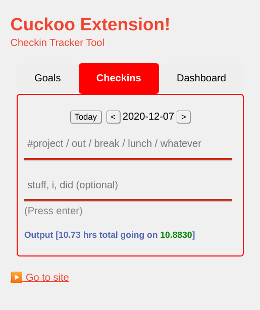

# Cuckoo Chrome Extension

> Note: Make sure that all checkin tool tabs are closed first as it considers the Chrome extension and any open tabs as one application which may cause saving issues.

Cuckoo Chrome Extension for Checkin Tracker Tool.



The aim of this extension is to expand the checkin tracker tool already available in TM without actually modifying what the users are comfortable with already. As such, this extension will re-use the inputs to add checkins and the time total so far which should be enough to keep track of the day.

The checkin tool will be rendered through an `<iframe />` window to ensure that the storage that keeps track of the time is constant throughout all the tools.

## Using Release

The quickest way to see it in action is by following the steps below:
1. download the latest release file for this project and unzip the compressed file
2. open `Google Chrome` or any `Chromium`-based browser
3. open the extensions page (alternatively, you can also type `chrome://extensions` in the URL)
4. select `Load Unpacked` and choose the `dist` folder from the file in step 1

You should now see the extension in your browser.

## Contributing

```bash
make init
```

Follow the instructions in [Using Release](#using-release). Modify [frame.css](./public/frame.css) as the style that overwrites the original application. For every change in the CSS, rebuild the loaded extension in local.

## App Local Preview

```bash
make dev
```

## Build

```bash
make build
```

This will create a directory in the project's local:

- `dist/` - contains the `Chrome Extension`-enabled files

Go to `Google Chrome` and enable `Developer Mode`. Select `Load Unpacked` and choose the `dist` directory. You should now see the extension in your browser.

## Image Source

Logo and `favicon.ico` from [here](https://www.favicon.cc/?action=icon&file_id=838863).
